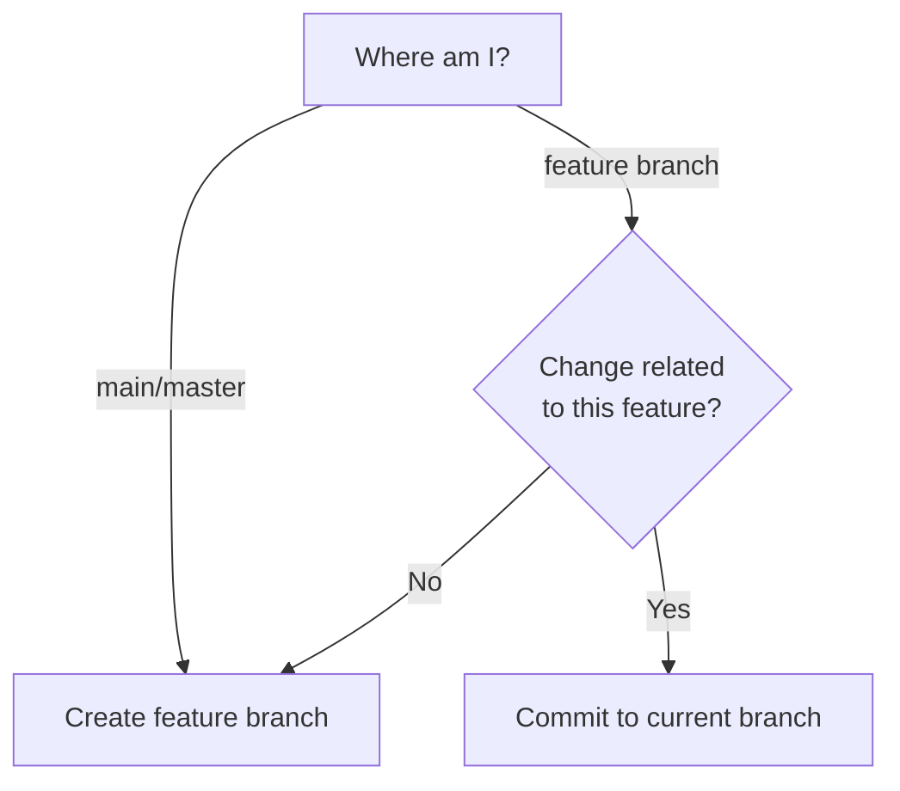

# Committing Changes

## Overview

ALWAYS use git-spice for creating commits and branches, and for amending commits.
NEVER use raw git commands for these purposes (git commit, git checkout -b, git branch $name).

The user may refer to this tool as `gs` or `git-spice`.
Always run commands with the full `git-spice` executable name.

**Why git-spice:** Maintains branch relationships and auto-rebases dependent branches.
Using raw git breaks stack tracking.

## When to Use

Use this skill for ALL commit operations:
- Creating commits on new or existing branches
- Amending commits
- Creating feature branches
- Stacking branches
- Recovering from raw git usage

**Triggers:**
- User asks to commit changes
- User asks to create a branch
- User asks to amend a commit
- User says "just commit quickly"
- User already used git commit/checkout

## Quick Reference

| Task | Command |
|------|---------|
| Get current branch name | `git branch --show-current` |
| New branch + commit | `git-spice branch create <name> -m '<shell-escaped-msg>'` |
| New branch + commit from detached HEAD | `git-spice branch create --target <base> <name> -m '<shell-escaped-msg>'` |
| Commit to current branch | `git-spice commit create -m '<shell-escaped-msg>'` |
| Amend (keep message) | `git-spice commit amend --no-edit` |
| Amend (change message) | `git-spice commit amend -m '<shell-escaped-new-msg>'` |
| Stack on different branch | `git-spice branch create --target <base> <name> -m '<shell-escaped-msg>'` |

**Never use `--insert` from the trunk branch.**
If currently on trunk (`main`/`master`),
create a normal feature branch from trunk instead.
Only use `--insert` when already working from a non-trunk stack position
and deliberately inserting into that stack.

**Branch naming:** lowercase-with-hyphens (no `/`, no uppercase, no user prefixes)
- If user provides non-conforming name, automatically normalize it and inform them

**Commit messages:** MUST follow [writing-commit-messages](writing-commit-messages.md) guidelines
- See the reference file in this skill directory

## Branching Decision

**If user explicitly states their intent, follow it directly:**
- "Commit to this branch" or "commit to current branch" → Use `git-spice commit create`
- "Create new branch" or "commit to new branch" → Use `git-spice branch create`
- No need to check current branch when intent is explicit

**Detached HEAD override for branch creation:**
- If `git branch --show-current` returns empty output,
  `HEAD` is detached.
- In that state,
  ALWAYS use
  `git-spice branch create --target <base> <name> -m '<shell-escaped-msg>'`.
- Resolve `<base>` to the repo's trunk branch (usually `main` or `master`),
  or the appropriate base branch if user specifies one.

**If user intent is ambiguous, determine from context:**



**Stacking:** Creating a new branch while on a feature branch automatically stacks it.
Never use `--insert` while on trunk (`main`/`master`);
from trunk, create a normal feature branch instead.

## Core Commands

### Create branch with commit

```bash
git-spice branch create <branch-name> -m '<shell-escaped-commit-message>'
```

- Commits **staged changes** to new branch
- Switches to new branch
- If on feature branch, stacks automatically
- If `HEAD` is detached,
  use
  `git-spice branch create --target <base> <branch-name> -m '<shell-escaped-commit-message>'`
  instead

**After creating branch:** Run `git-spice ls` to show branch position in stack (NOT git log).

**Example:**
```bash
# On main
git-spice branch create fix-login-validation -m 'Fix email validation in login form'

# On feature-auth, creating unrelated change
git-spice branch create update-readme -m 'Update installation instructions'
# This stacks update-readme on top of feature-auth

# On detached HEAD
git-spice branch create --target main recover-work -m 'Recover detached HEAD work'
# Use base branch, if specified by user, or default to main/master
```

### Commit to current branch

```bash
git-spice commit create -m '<shell-escaped-commit-message>'
```

Commits **staged changes** to current branch.

**After committing:** Run `git-spice ls` to show branch position in stack (NOT git log).

### Get current branch name

```bash
git branch --show-current
```

**IMPORTANT:** `git-spice branch current` does NOT exist.
git-spice doesn't have a command for showing the current branch.
Use standard git command: `git branch --show-current`
If the command prints nothing,
`HEAD` is detached.

**Common use cases:**
- When user asks "what branch am I on?"
- Debugging branch-related issues
- When user's commit intent is ambiguous and you need to determine strategy

**NOT needed when:**
- User explicitly says "commit to this branch" (intent is clear)
- User explicitly says "create new branch" (intent is clear)

### Amend last commit

```bash
# Keep existing message
git-spice commit amend --no-edit

# Replace entire message
git-spice commit amend -m '<shell-escaped-new-complete-message>'
```

**CRITICAL:** `git-spice commit amend -m` REPLACES the entire commit message.
If user says "add" or "append" to message, you MUST include the original message + addition.

**Example:**
```bash
# Original message: "Fix login validation"
# User: "Add note about regex update"

# ❌ WRONG: git-spice commit amend -m "Also updates regex pattern"
# ✅ CORRECT: git-spice commit amend -m 'Fix login validation

Also updates regex pattern'
```

### Stack on specific branch

```bash
git-spice branch create --target <target-branch> <branch-name> -m '<shell-escaped-commit-message>'
```

Useful when current branch isn't the desired base.

## Shell-Safe Commit Message Quoting

Commit messages are data,
not shell code.
When passing a generated commit message to `git-spice -m`,
wrap the entire message in single quotes.

Single quotes allow commit messages to contain literal Markdown backticks,
`$(...)`,
`$variables`,
double quotes,
backslashes,
and multi-line bodies
without shell evaluation.

If the message contains a literal single quote (`'`),
escape it by closing the quote,
inserting an escaped quote,
and reopening the quote:

```bash
'\''
```

For example,
this commit message:

```text
Fix user's `$(example)` handling

Keep shell-looking text literal in commit messages.
```

must be passed as:

```bash
git-spice commit create -m 'Fix user'\''s `$(example)` handling

Keep shell-looking text literal in commit messages.'
```

**DO NOT** use double quotes for generated commit messages.
Double quotes allow shell evaluation of `$(...)`,
backticks,
and `$variables`.

**DO NOT** use `$'...'` for generated commit messages.
It prevents command substitution,
but it still treats backslashes and escape sequences as shell syntax.

## Branch Naming Rules

**Required:**
- Lowercase only
- Hyphens to separate words
- Descriptive (fix-login-bug, add-user-search)

**Forbidden:**
- Slashes: ~~feature/login~~
- Uppercase: ~~FixLogin~~
- User prefixes: ~~john/fix~~ or ~~abg-fix~~

**Why no prefixes:** git-spice automatically adds user prefixes if configured.
Adding them manually results in double-prefixing (e.g., `abg-abg-fix-bug`).
Just use descriptive names: `fix-bug` not `abg-fix-bug`.

## NEVER Use Raw Git

### ❌ NEVER: `git checkout -b <branch>`

**Why:** Bypasses git-spice tracking. Branch won't be in the stack.

**Instead:**
1. Stage changes: `git add <files>`
2. Get commit message: Use writing-commit-messages skill
3. Create branch:
   `git-spice branch create <name> -m '<shell-escaped-message>'`

### ❌ NEVER: `git commit` or `git commit --amend`

**Why:** Bypasses git-spice rebase. Dependent branches become stale.

**Instead:**
- New commit: `git-spice commit create -m '<shell-escaped-message>'`
- Amend: `git-spice commit amend --no-edit`
  or `git-spice commit amend -m '<shell-escaped-new-message>'`

### ❌ NEVER: `git branch <name>`

**Why:** Creates untracked branch outside stack.

**Instead:** Use `git-spice branch create` with commit.

### ❌ NEVER: `git-spice branch current`

**Why:** Command doesn't exist. git-spice has no equivalent for this.

**Instead:** Use `git branch --show-current`

**Common mistake:** Assuming every git command has a git-spice equivalent.
**Reality:** Some operations (like showing current branch) still use standard git.

### ❌ NEVER: `git-spice branch create <name> -m '<message>'` from detached `HEAD`

**Why:** Without a base branch to work from, the command will fail.

**Instead:** Use
`git-spice branch create --target <base> <name> -m '<shell-escaped-message>'`,
with `<base>` set to user-specified base branch or trunk (main/master).

### ❌ NEVER: `git-spice branch create --insert ...` from trunk

**Why:** `--insert` is for inserting into an existing non-trunk stack.
Using it from trunk muddies the stack topology and can create confusing branch relationships.

**Instead:** If on trunk (`main`/`master`),
create a normal feature branch:
`git-spice branch create <name> -m '<shell-escaped-message>'`.

## Red Flags - STOP

If you're about to:
- Use any `git commit` command
- Use `git checkout -b`
- Use `git branch` to create a branch
- Use `git-spice branch create --insert` while on trunk (`main`/`master`)
- Use `git-spice branch current` (doesn't exist)
- Put a generated commit message in double quotes or `$'...'`
- Skip getting a proper commit message
- Add a prefix like `abg-`, `john/`, or `user-` to branch names
- Rationalize "just this once" or "it's faster"
- Assume a git-spice command exists because "git-spice does everything"

**STOP. Use git-spice commands instead.**

**Note:** git-spice does NOT have every git equivalent.
For getting current branch: use `git branch --show-current`

## Recovery: User Already Used Raw Git

**Scenario:** User ran `git checkout -b bad-name` and `git commit -m "fix"`

**DO NOT just push it.** Fix the violations:

1. **Acknowledge the issue:**
   "This branch/commit doesn't follow conventions. Let me fix it before pushing."

2. **Check what's committed:**
   ```bash
   git log -1 --oneline
   ```

3. **Fix commit message:**
   - Follow [writing-commit-messages](writing-commit-messages.md) guidelines to generate proper message
   - Amend:
     `git-spice commit amend -m '<shell-escaped-proper-message>'`

4. **Fix branch name if needed:**
   ```bash
   git-spice branch rename <proper-name>
   ```

5. **Track in git-spice (if not already tracked):**
   ```bash
   git-spice branch track
   ```

**Note:** After recovery, the branch is properly integrated into git-spice.

## Common Mistakes

| Mistake | Why Bad | Solution |
|---------|---------|----------|
| Using `git-spice branch current` | Command doesn't exist | Use `git branch --show-current` instead |
| Running `git log` after commit | Doesn't show stack position | Run `git-spice ls` instead |
| Using amend -m with only addition | Replaces message, loses original | Include full original + addition |
| "Just commit quickly" | Skips proper message, may use raw git | Still use git-spice + [writing-commit-messages](writing-commit-messages.md) guidelines |
| User provides bad branch name | Violates naming rules | Auto-normalize: "Using `lowercase-version` instead" |
| Commit without following message guidelines | Poor quality messages | Follow [writing-commit-messages](writing-commit-messages.md) first |
| Accepting raw git "because user prefers it" | Breaks stack, defeats purpose | Never accept. Explain why git-spice is required |
| Asking permission to normalize names | Wastes time | Just normalize and inform |
| Adding user prefix to branch name | git-spice auto-adds prefixes | Just use descriptive name: `fix-bug` not `abg-fix-bug` |
| Using double quotes or `$'...'` for generated commit messages | Lets shell syntax leak into message handling | Use single quotes and escape embedded `'` as `'\''` |
| Using plain `branch create` on detached `HEAD` | Bases work on detached ref | Use `git-spice branch create --target <trunk> ...` |
| Using `--insert` from trunk | `--insert` is for non-trunk stack insertion | From trunk, use normal `git-spice branch create ...` |

## Pressure Resistance

| Excuse | Reality |
|--------|---------|
| "Production down, use `git-spice branch current` now" | Command doesn't exist. Use `git branch --show-current`. Takes same time. |
| "Just commit quickly, demo in 10 min" | git-spice is just as fast as git. Use proper commands. |
| "I prefer raw git, it's simpler" | Raw git breaks branch tracking. Use git-spice. |
| "I already committed with git" | Fix it before pushing. See Recovery section. |
| "It's a small change, doesn't matter" | Every commit matters. Use proper workflow. |
| "git-spice should have everything" | git-spice doesn't replace all git commands. Check the skill. |
| "Detached HEAD is fine, just create the branch" | Fine, but branch creation must target `$trunk`. |

**No exceptions for:**
- Time pressure
- "Small" changes
- User preference
- Emergency fixes

## Integration with writing-commit-messages.md

**Before ANY commit:**
1. Consult [writing-commit-messages](writing-commit-messages.md) in this skill directory
2. Use those guidelines to generate commit message
3. Then use git-spice command with that message

**Example workflows:**

**Explicit: commit to current branch (no branch check needed):**
```
User: "Commit these changes to current branch"
You: [Follow writing-commit-messages.md → craft message]
You: [Run git-spice commit create -m '<shell-escaped-generated-message>']
```

**Explicit: commit to new branch (no branch check needed):**
```
User: "Commit these changes to new feature branch"
You: [Follow writing-commit-messages.md → craft message]
You: [Run git-spice branch create <branch-name> -m '<shell-escaped-generated-message>']
```

## Real-World Impact

**Without this skill:** Agents use raw git, breaking stack relationships, requiring manual rebases, creating tracking confusion.

**With this skill:** Clean stacked branches, automatic rebases, proper tracking, professional commit history.
