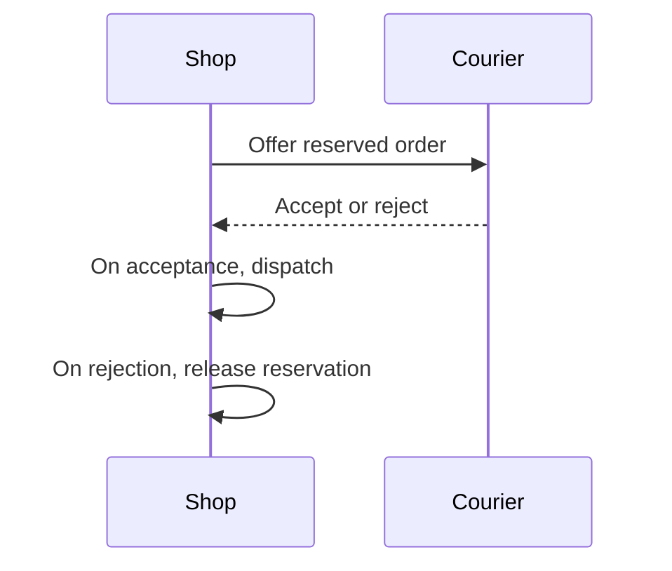

# Representation scenarios

Use the runner and independent-grading procedure in [README.md](README.md).
These invented scenarios protect medium selection and preserved meaning,
not a minimum number of diagrams or a fixed output template.

## Revise a process without inheriting its paragraph form

### Prompt

Use the writing guidance at {GUIDANCE_PATH} and its applicable references.
Revise this design note for a maintenance engineer who must evaluate the
decision without the design conversation. Preserve the material facts,
conditions and scope. Return the revised note, with no editing commentary.
Do not modify files or query external sources.

# Resume irrigation safely after controller restart

## Context

A watering request names a greenhouse bed and a duration. The Controller
stores the request and a pump worker claims it. The worker sends a start
command to the Pump service. Pump returns a session identifier and the
worker records it in the request database. Recording a request does not
prove that Pump received its command, and Pump accepting a command does
not prove that the session identifier was recorded. Workers release their
claims on exit; a replacement claims unfinished requests.

For a request with a stored session, the worker asks Pump for that session's
status. Pump may return Running, Complete, or Unknown. Running is checked
again later; Complete finishes the request. Unknown leaves the request
unresolved and alerts the operator. None of these responses starts a session.

For a request without a stored session, the current worker starts the pump.
If Pump starts watering but the response is lost, the next worker can start
another session. If the worker stops before sending anything, retrying is
necessary to water the bed. The database looks the same in those two cases.

## Decision

The Controller will store a request key before sending the first command.
Every worker will send the same request key for that request. Pump's new
command contract accepts a key once and returns the original session on
repeated commands with that key. A repeat does not restart watering or
extend its duration. A new request uses a new key, even for the same bed.
Pump retains the key for 48 hours. Controller retries are permitted only
within 24 hours of the request's creation. After 24 hours, a request without
a session goes to operator review instead of starting watering. These are
proposed contracts, not existing deployed behavior.

Workers with stored sessions keep the existing status handling. Operators
can cancel a stored session through Pump. Cancellation without a session
identifier stops retries locally but does not prove the pump is stopped.
The operator must inspect the bed before declaring it safe for maintenance.
An unknown session also requires inspection; a successful status request
with no record is not proof that no watering happened.

## Consequences

Reusing the request key would handle both a lost start response and a
restart before sending. Retention and retry windows must stay aligned.
Pump must deploy the new key contract before Controller enables retries
under this decision. Older pumps do not provide the guarantee. The plan
does not change normal durations, bed selection, manual pump operation,
or the Running and Complete status paths.

A simulated test dropped a start response and observed that a retry returned
the same session without starting again. A second test stopped the worker
before sending and observed one session after restart. A third advanced the
clock past 24 hours and observed operator review without a start command.
No physical pump test or deployment has occurred.

### Expected behavior

- Expose the distinction between a stopped worker before sending and a lost
  response after a session starts; retain the proposed key contract.
- Let readers trace relevant branches to their consequences and look up status
  actions without assembling separated prose.
- Preserve the 48-hour retention, 24-hour retry limit, deployment order,
  maintenance-inspection requirement, and simulation-only evidence.
- Do not treat a paragraph revision as a source-formatting-only task or require
  a particular diagram syntax.

### Unacceptable behavior

- Lose a material source condition, invent a relationship, or overstate evidence.
- Substitute decorative boxes, paragraph bullets, dense table cells,
  or repeated narration for the required reader task.

## Compare alternatives in ordinary chat

### Prompt

Use the writing guidance at {GUIDANCE_PATH} and its applicable references.
Write the response using only these facts. Do not change files.

User: "Which storage plan should we choose for a small research archive?
Explain the tradeoffs so I can make the decision. We have a 30-credit monthly
budget, need 500 GB, and can wait a day to retrieve an old dataset."

Basic costs 12 credits/month, stores 250 GB, restores immediately, and
permits 1 account. Team costs 28 credits/month, stores 750 GB, restores
within 12 hours, and permits 4 accounts. Rapid costs 45 credits/month,
stores 1 TB, restores immediately, and permits 4 accounts.
All plans retain backups for 30 days. No other price or reliability
differences are established. All figures are invented for this exercise.

### Expected behavior

- Recommend Team from the supplied budget, capacity, and retrieval constraints.
- Align common dimensions in a scannable comparison rather than separate prose descriptions.
- Preserve common backup retention and the lack of established reliability
  differences; do not invent prices or require research for invented figures.
- Use prose for the decision and material interpretation without narrating every table cell.

### Unacceptable behavior

- Lose a material source condition, invent a relationship, or overstate evidence.
- Substitute decorative boxes, paragraph bullets, dense table cells,
  or repeated narration for the required reader task.

## Group a multi-part handoff

### Prompt

Use the writing guidance at {GUIDANCE_PATH} and applicable references.
Answer the user using the following invented facts only. No external queries.

User: "I'm handing the neighborhood workshop to someone else tomorrow.
What's ready, what still needs doing, and what do you need from me?"

The room booking is confirmed for 3 to 5 pm. Printed handouts are packed.
Two volunteers will arrive at 2:30 pm. The projector has not been tested;
it can be tested on arrival. The welcome email is drafted but not sent.
The user must choose whether to serve tea or coffee before the supplies
can be purchased. No one has yet been assigned to send the welcome email
or buy supplies. Do not infer that owner or invent approvals.

### Expected behavior

- Make ready items, remaining work, and needed user decisions easy to locate.
- Keep the tea-or-coffee decision before supply purchase, and preserve that two
  owners are unspecified.
- Use a compact list, table, or another defensible grouping; do not add a
  diagram without a distinct relationship to expose.
- Do not turn missing owners into invented assignments.

### Unacceptable behavior

- Lose a material source condition, invent a relationship, or overstate evidence.
- Substitute decorative boxes, paragraph bullets, dense table cells,
  or repeated narration for the required reader task.

## Keep an ordinary follow-up short

### Prompt

Use the writing guidance at {GUIDANCE_PATH} and applicable references.
Answer only the latest user question. No file changes or external queries.

Earlier conversation:
User: "When can I edit my photo album during a background upload?"
Assistant: "Before Upload starts, you can edit freely. During Upload,
captions can change but photos cannot be removed. Once Upload finishes,
editing is unrestricted. If Upload fails, the same lock stays until you
cancel or retry. Cancel releases the lock and removes only temporary copies."
User: "Okay. It failed and I don't want to retry. Does cancel delete my photos?"

Established facts: Cancel deletes temporary upload copies only; it leaves
the original album photos intact and releases the editing lock. No other
product behavior is established.

### Expected behavior

- Answer that original photos remain intact, temporary copies are removed, and editing is unlocked.
- Build on the conversation rather than restarting the whole upload explanation.
- Use a short prose answer; a diagram or table adds no useful relationship here.

### Unacceptable behavior

- Lose a material source condition, invent a relationship, or overstate evidence.
- Substitute decorative boxes, paragraph bullets, dense table cells,
  or repeated narration for the required reader task.

## Repair the representation within its explanation

### Prompt

Use the writing guidance at {GUIDANCE_PATH} and applicable references.
Respond to the latest user message. Use the supplied facts; no external tools.

Previous answer:
"Your order stays reserved while the courier accepts it. The shop releases
the reservation only after courier rejection or an explicit user cancellation.



A lost reply leaves the order reserved until its status is resolved.
The user can cancel during this interval; cancellation releases the
reservation and prevents later dispatch. This describes the proposed
behavior. A simulation passed; the courier integration is not deployed."

Latest user: "The diagram didn't render. Please fix the explanation."

### Expected behavior

- Replace the unsupported rendering with a compatible representation and return
  the requested explanation with it in place.
- Preserve acceptance, rejection, uncertainty, and cancellation outcomes;
  cancellation prevents later dispatch.
- Keep the proposed-behavior and simulation-versus-deployment qualifications.
- Permit a table or simpler diagram; do not require preserving the failed syntax.

### Unacceptable behavior

- Lose a material source condition, invent a relationship, or overstate evidence.
- Substitute decorative boxes, paragraph bullets, dense table cells,
  or repeated narration for the required reader task.

## Carry a useful model into an external artifact

### Prompt

Use the writing guidance at {GUIDANCE_PATH} and applicable references.
Create a short onboarding note for volunteers who did not see this chat.
It will be read as ordinary Markdown. Do not publish or modify other files.

Earlier explanation accepted in chat:
"The library desk assigns incoming donations to Sorting. Sorting sends
books in good condition to Cataloging and damaged books to Repair.
Cataloging puts listed books on shelves. Repair returns repaired books to
Sorting; books that cannot be repaired are recycled. The donor receives
a receipt at intake, not when the book reaches a shelf.

```text
Desk → Sorting → Cataloging → Shelves
         │
         └→ Repair ─┬→ Sorting (repaired)
                    └→ Recycle (cannot repair)
```

The receipt confirms acceptance of the donation. It does not promise that
every donated book will be shelved."

The note needs the process, the loop, the terminal outcomes, and what the
receipt means. No additional review, approvals, deadlines, or owners exist
in the supplied facts. The organization and process are invented.

### Expected behavior

- Make the process understandable to a reader outside the conversation while
  preserving the useful structure.
- Preserve Sorting, Cataloging, Repair, the return to Sorting, and both terminal outcomes.
- Keep intake receipt distinct from a promise to shelve the book.
- Use a destination-compatible representation, with no invented reviews, deadlines, or approvals.

### Unacceptable behavior

- Lose a material source condition, invent a relationship, or overstate evidence.
- Substitute decorative boxes, paragraph bullets, dense table cells,
  or repeated narration for the required reader task.

## Select the skill for comparisons, but not bare lookups

### Prompt

Available skills:

- prose-writing: {GUIDANCE_DESCRIPTION}
- prose-formatting: Use when writing or editing prose other than ordinary
  conversational chat, including formatting-only edits, or when the user
  requests source-style prose in chat.
- diagram-design: Use when planning or creating an explanatory 2D diagram,
  not for quantitative charts or prose-only explanations.

Choose the skill or skills to load for each independent request.
Do not answer the requests or read skill bodies.

A. "Put these three membership options together so I can compare price,
seats, and renewal date. Here are the values; I need the comparison in chat."

B. "The meeting is at 3 pm. Return only its time."

C. "Explain why the reservation can remain after the worker stops."

### Expected behavior

- A and C select prose-writing; B selects none of these skills.
- Ordinary chat does not select prose-formatting.
- A factual comparison is distinct from a bare factual lookup.
- Do not infer a saved artifact or a diagram request.

### Unacceptable behavior

- Exclude A solely because its supplied values are factual or it is in chat.
- Select prose-writing for every response merely because it contains words.

## Preserve an explicitly constrained paragraph

### Prompt

Use the guidance at {GUIDANCE_PATH} and applicable references.
The user requests one paragraph of no more than three sentences,
with no lists, tables, diagrams, or code.
Explain the following invented behavior using only the supplied facts.
A teacher saves a lesson, then the school site copies it to a public preview.
Saving can succeed while the copy fails.
The teacher can retry the copy without editing or saving the lesson again.
The public preview still shows the earlier version until the copy succeeds.

### Expected behavior

- Honor the explicit prose-only format and sentence limit.
- Preserve the save/copy distinction, retry scope, and preview behavior.
- Do not force a diagram, offer unsolicited formats, or drop a causal condition.

### Unacceptable behavior

- Treat the general medium-selection rule as overriding the user's format.

## Enter through normal chat instructions

### Prompt

Read and apply {AGENTS_PATH} for this task.
These candidate catalog entries replace installed entries with the same names:

{SKILL_CATALOG}

The workshop handoff has four facts:
registration is open, handouts still need printing,
someone must choose a room, and dietary needs have not been collected.
Tell me what is ready and what needs attention.
No person has been assigned to the remaining work.
Return the answer in chat without external research or file changes.

### Expected behavior

- Enter through the AGENTS instructions, select prose-writing, and read its body.
- Expose the independent handoff items for scanning without inventing owners.
- If selecting a list, read the conditional representation reference.
- Verify those reads from tool access records, not the runner's declaration.
- Keep source-formatting guidance out of ordinary chat.

### List-construction variant

Use the same AGENTS instructions and catalog in a fresh context.
Replace "Tell me what is ready and what needs attention" with
"Give me a short list of what is ready and what needs attention."

- Preserve the facts in scannable items and read the representation reference.
- Confirm the read from the tool trace.

### Adjacent bare-lookup variant

Use the same AGENTS instructions and catalog in a fresh context.
Replace the workshop request with: "The meeting is at 3 pm.
Return only its time."

- Return only the supplied time without loading prose-writing,
  prose-formatting, or the representation reference.
