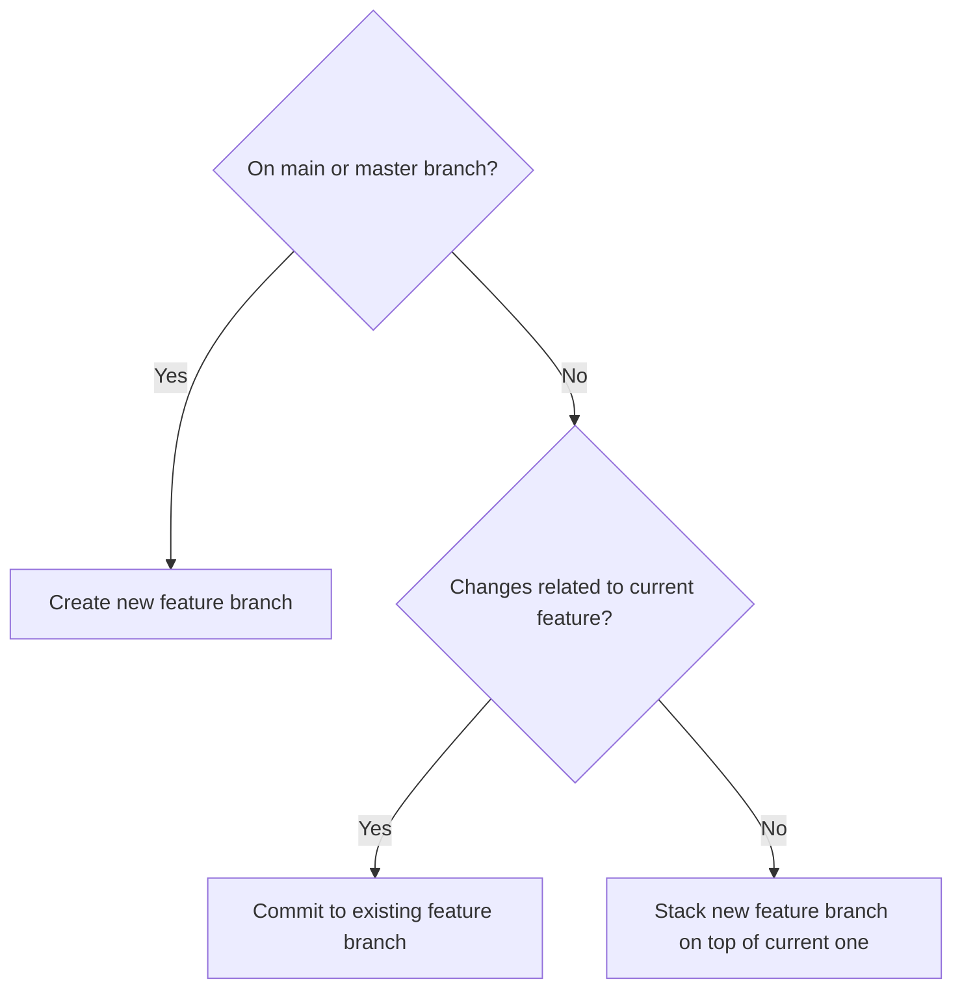

# Committing changes

## Instructions

Use git-spice (`gs`) to commit changes to the codebase.
Never use raw git commands directly for this task.

- If we're on the main or master branch (`git branch --show-current`),
  ALWAYS create a feature branch.
- If we're on a feature branch,
  AND the changes to be committed are related to the feature,
  commit to the existing branch.
- If you're on a feature branch,
  and the changes to be committed are unrelated to the feature,
  stack a new feature branch on top of the current one.

### When to use

ALWAYS use this skill when:

- Creating a new feature branch
- Committing changes to an existing branch
- Amending the last commit on a branch

ALWAYS use git-spice commands to commit changes to new or existing branches.
NEVER use `git checkout -b` or `git commit` directly.
NEVER use `git commit --amend` directly.

## Flowchart



### Creating a new feature branch

Before creating a feature branch,
use the writing-commits skill to generate a properly formatted commit message.

**Example workflow:**

1. Invoke the writing-commits skill: `Skill(writing-commits)`
2. Generate commit message based on the staged changes
3. Run the following command to create a new feature branch:

```
gs branch create <branch-name> -m "<commit-message>"
```

Where `<branch-name>` is a descriptive name for the new branch,
and `<commit-message>` is the commit message generated from the writing-commits skill.

This will commit all **staged** changes to the new branch
and switch to that branch.

#### Stacking a new feature branch on top of the current one

To stack a new feature branch on top of the current one,
use the same command as creating a new feature branch.

#### Stacking on top of a different branch

To stack on top of a different branch, use the `--target` option:

```
gs branch create --target <target-branch> <branch-name> -m "<commit-message>"
```

Where `<target-branch>` is the name of the branch to stack on top of.

### Committing to a feature branch

Before committing to a feature branch,
use the writing-commits skill to generate a properly formatted commit message.

**Example workflow:**

1. Invoke the writing-commits skill: `Skill(writing-commits)`
2. Generate commit message based on the staged changes
3. Run the following command to commit changes:

```
gs commit create -m "<commit-message>"
```

Where `<commit-message>` is the commit message generated from the writing-commits skill.

This will commit all **staged** changes to the current branch.

### Amending the last commit

To amend the last commit on the current feature branch,
use the following command:

```
gs commit amend
```

This will amend the last commit with the staged changes,
retaining the existing commit message.

#### Changing the commit message when amending

To amend the last commit and change the commit message,
use the following command:

```
gs commit amend -m "<new-commit-message>"
```

This will amend the last commit with the staged changes
and update the commit message.

## Naming branches

Do:

- DO use descriptive names for feature branches.
- DO use `-` to separate words in branch names.
- DO use lowercase letters in branch names.

Don't:

- DO NOT use `/` in branch names.
- DO NOT use uppercase letters in branch names.

NEVER prefix branch names with the user name or initials.
These are added automatically by git-spice if needed.
