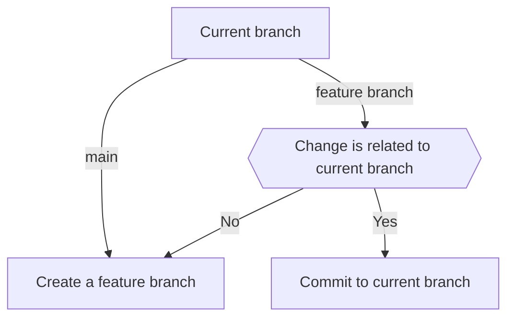

# Committing changes

## Overview

To commit changes, we ALWAYS use git-spice (`gs`) commands.

Commit messages MUST be generated using the writing-commit-messages skill.

Branch names MUST use descriptive names with `-` as word separators.

## Quick command reference

1. Commit staged changes to a new feature branch:

   ```
   gs branch create <branch-name> -m "<commit-message>"
   ```

2. Commit staged changes to the current feature branch:

   ```
   gs commit create -m "<commit-message>"
   ```

3. Amend the last commit without changing the commit message:

   ```
   gs commit amend
   ```

4. Amend the last commit and change the commit message:

   ```
   gs commit amend -m "<new-commit-message>"
   ```

All commit messages MUST be generated using the writing-commit-messages skill.

## Branching strategy



In other words:

- If on the main or master branch, create a feature branch.
- If on a feature branch AND the change is related to the feature,
  commit to the existing branch.
- If on a feature branch AND the change is unrelated to the feature,
  create a new feature branch stacked on top of the current one.

## Detailed instructions

### Creating a new feature branch

```
gs branch create <branch-name> -m "<commit-message>"
```

Where `<branch-name>` is a descriptive name for the new branch,
and `<commit-message>` is the commit message generated from the
writing-commit-messages skill.

This will commit all **staged** changes to the new branch
and switch to that branch.

#### Stacking a new feature branch on top of the current one

To stack a new feature branch on top of the current one,
use the same command as creating a new feature branch.

#### Stacking on top of a different branch

To stack on top of a different branch, use the `--target` option:

```
gs branch create --target <target-branch> <branch-name> -m "<commit-message>"
```

Where `<target-branch>` is the name of the branch to stack on top of.

### Committing to a feature branch

```
gs commit create -m "<commit-message>"
```

Where `<commit-message>` is the commit message generated from the
writing-commit-messages skill.

This will commit all **staged** changes to the current branch.

### Amending the last commit

To amend the last commit on the current feature branch,
use the following command:

```
gs commit amend
```

This will amend the last commit with the staged changes,
retaining the existing commit message.

#### Changing the commit message when amending

To amend the last commit and change the commit message,
use the following command:

```
gs commit amend -m "<new-commit-message>"
```

This will amend the last commit with the staged changes
and update the commit message.

## Naming branches

Do:

- DO use descriptive names for feature branches.
- DO use `-` to separate words in branch names.
- DO use lowercase letters in branch names.

Don't:

- DO NOT use `/` in branch names.
- DO NOT use uppercase letters in branch names.

NEVER prefix branch names with the user name or initials.
These are added automatically by git-spice if needed.

## Common mistakes

### Using `git checkout -b <branch-name>` to create a new branch

Never use `git checkout -b <branch-name>` to create a new branch.

**Why**:
This bypasses git-spice,
which means the new branch will not be tracked properly.

**Solution**

1. Stage the changes that need to be committed.
2. Generate a commit message using the writing-commit-messages skill.
3. Use `gs branch create <branch-name> -m "<commit-message>"`.

### Using `git commit` or `git commit --amend`

Never use `git commit` directly.

**Why**:
This bypasses git-spice,
which means related branches will not be rebased.

**Solution**:

1. Stage the changes that need to be committed.
2. If creating a new commit, generate a commit message using the writing-commit-messages skill.
3. Use one of the following commands based on the situation:

    ```
    # To create a new commit
    gs commit create -m "<commit-message>"

    # To amend the last commit without changing the message
    gs commit amend

    # To amend the last commit and change the message
    gs commit amend -m "<new-commit-message>"
    ```
