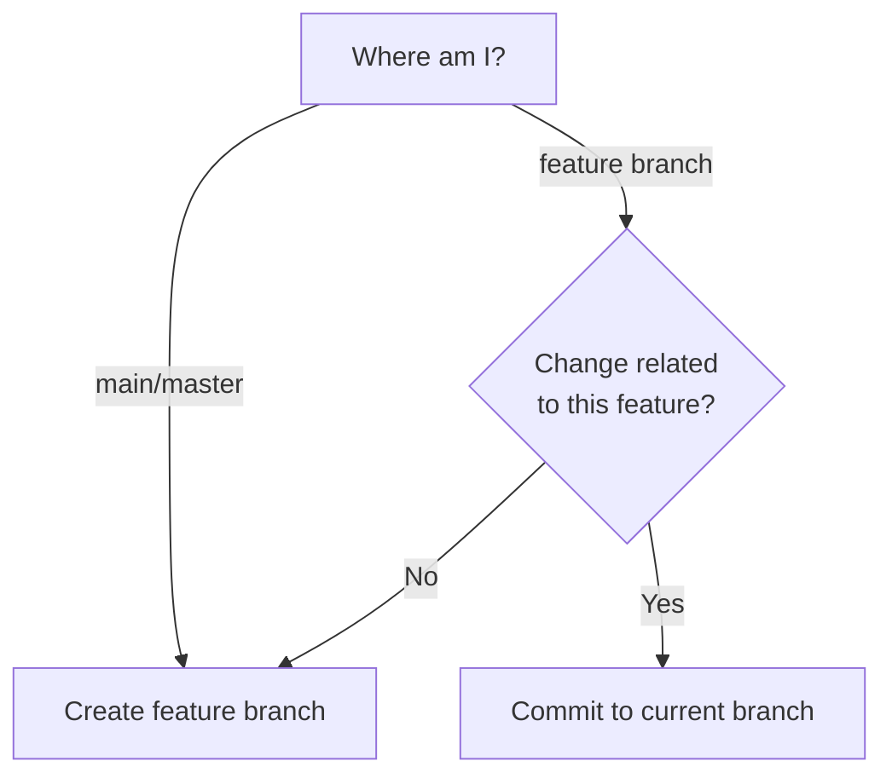

# Committing Changes

## Overview

ALWAYS use git-spice (`gs`) for creating commits and branches, and for amending commits.
NEVER use raw git commands for these purposes (git commit, git checkout -b, git branch $name).

**Why git-spice:** Maintains branch relationships and auto-rebases dependent branches.
Using raw git breaks stack tracking.

## When to Use

Use this skill for ALL commit operations:
- Creating commits on new or existing branches
- Amending commits
- Creating feature branches
- Stacking branches
- Recovering from raw git usage

**Triggers:**
- User asks to commit changes
- User asks to create a branch
- User asks to amend a commit
- User says "just commit quickly"
- User already used git commit/checkout

## Quick Reference

| Task | Command |
|------|---------|
| Get current branch name | `git branch --show-current` |
| New branch + commit | `gs branch create <name> -m "<msg>"` |
| Commit to current branch | `gs commit create -m "<msg>"` |
| Amend (keep message) | `gs commit amend` |
| Amend (change message) | `gs commit amend -m "<new-msg>"` |
| Stack on different branch | `gs branch create --target <base> <name> -m "<msg>"` |

**Branch naming:** lowercase-with-hyphens (no `/`, no uppercase, no user prefixes)
- If user provides non-conforming name, automatically normalize it and inform them

**Commit messages:** MUST use writing-commit-messages skill first
- Use `Skill(writing-commit-messages)` to load and execute it

## Branching Decision

**If user explicitly states their intent, follow it directly:**
- "Commit to this branch" or "commit to current branch" → Use `gs commit create`
- "Create new branch" or "commit to new branch" → Use `gs branch create`
- No need to check current branch when intent is explicit

**If user intent is ambiguous, determine from context:**



**Stacking:** Creating a new branch while on a feature branch automatically stacks it.

## Core Commands

### Create branch with commit

```bash
gs branch create <branch-name> -m "<commit-message>"
```

- Commits **staged changes** to new branch
- Switches to new branch
- If on feature branch, stacks automatically

**After creating branch:** Run `gs ls` to show branch position in stack (NOT git log).

**Example:**
```bash
# On main
gs branch create fix-login-validation -m "Fix email validation in login form"

# On feature-auth, creating unrelated change
gs branch create update-readme -m "Update installation instructions"
# This stacks update-readme on top of feature-auth
```

### Commit to current branch

```bash
gs commit create -m "<commit-message>"
```

Commits **staged changes** to current branch.

**After committing:** Run `gs ls` to show branch position in stack (NOT git log).

### Get current branch name

```bash
git branch --show-current
```

**IMPORTANT:** `gs branch current` does NOT exist.
git-spice doesn't have a command for showing the current branch.
Use standard git command: `git branch --show-current`

**Common use cases:**
- When user asks "what branch am I on?"
- Debugging branch-related issues
- When user's commit intent is ambiguous and you need to determine strategy

**NOT needed when:**
- User explicitly says "commit to this branch" (intent is clear)
- User explicitly says "create new branch" (intent is clear)

### Amend last commit

```bash
# Keep existing message
gs commit amend

# Replace entire message
gs commit amend -m "<new-complete-message>"
```

**CRITICAL:** `gs commit amend -m` REPLACES the entire commit message.
If user says "add" or "append" to message, you MUST include the original message + addition.

**Example:**
```bash
# Original message: "Fix login validation"
# User: "Add note about regex update"

# ❌ WRONG: gs commit amend -m "Also updates regex pattern"
# ✅ CORRECT: gs commit amend -m "Fix login validation

Also updates regex pattern"
```

### Stack on specific branch

```bash
gs branch create --target <target-branch> <branch-name> -m "<commit-message>"
```

Useful when current branch isn't the desired base.

## Branch Naming Rules

**Required:**
- Lowercase only
- Hyphens to separate words
- Descriptive (fix-login-bug, add-user-search)

**Forbidden:**
- Slashes: ~~feature/login~~
- Uppercase: ~~FixLogin~~
- User prefixes: ~~john/fix~~

**Why no prefixes:** git-spice adds them automatically if configured.

## NEVER Use Raw Git

### ❌ NEVER: `git checkout -b <branch>`

**Why:** Bypasses git-spice tracking. Branch won't be in the stack.

**Instead:**
1. Stage changes: `git add <files>`
2. Get commit message: Use writing-commit-messages skill
3. Create branch: `gs branch create <name> -m "<message>"`

### ❌ NEVER: `git commit` or `git commit --amend`

**Why:** Bypasses git-spice rebase. Dependent branches become stale.

**Instead:**
- New commit: `gs commit create -m "<message>"`
- Amend: `gs commit amend` or `gs commit amend -m "<new-message>"`

### ❌ NEVER: `git branch <name>`

**Why:** Creates untracked branch outside stack.

**Instead:** Use `gs branch create` with commit.

### ❌ NEVER: `gs branch current`

**Why:** Command doesn't exist. git-spice has no equivalent for this.

**Instead:** Use `git branch --show-current`

**Common mistake:** Assuming every git command has a gs equivalent.
**Reality:** Some operations (like showing current branch) still use standard git.

## Red Flags - STOP

If you're about to:
- Use any `git commit` command
- Use `git checkout -b`
- Use `git branch` to create a branch
- Use `gs branch current` (doesn't exist)
- Skip getting a proper commit message
- Rationalize "just this once" or "it's faster"
- Assume a gs command exists because "gs does everything"

**STOP. Use git-spice commands instead.**

**Note:** git-spice does NOT have every git equivalent.
For getting current branch: use `git branch --show-current`

## Recovery: User Already Used Raw Git

**Scenario:** User ran `git checkout -b bad-name` and `git commit -m "fix"`

**DO NOT just push it.** Fix the violations:

1. **Acknowledge the issue:**
   "This branch/commit doesn't follow conventions. Let me fix it before pushing."

2. **Check what's committed:**
   ```bash
   git log -1 --oneline
   ```

3. **Fix commit message:**
   - Use `Skill(writing-commit-messages)` to generate proper message
   - Amend: `gs commit amend -m "<proper-message>"`

4. **Fix branch name if needed:**
   ```bash
   gs branch rename <proper-name>
   ```

5. **Track in git-spice (if not already tracked):**
   ```bash
   gs branch track
   ```

**Note:** After recovery, the branch is properly integrated into git-spice.

## Common Mistakes

| Mistake | Why Bad | Solution |
|---------|---------|----------|
| Using `gs branch current` | Command doesn't exist | Use `git branch --show-current` instead |
| Running `git log` after commit | Doesn't show stack position | Run `gs ls` instead |
| Using amend -m with only addition | Replaces message, loses original | Include full original + addition |
| "Just commit quickly" | Skips proper message, may use raw git | Still use gs + Skill(writing-commit-messages) |
| User provides bad branch name | Violates naming rules | Auto-normalize: "Using `lowercase-version` instead" |
| Commit without writing-commit-messages skill | Poor quality messages | Load with Skill(writing-commit-messages) first |
| Accepting raw git "because user prefers it" | Breaks stack, defeats purpose | Never accept. Explain why gs is required |
| Asking permission to normalize names | Wastes time | Just normalize and inform |

## Pressure Resistance

| Excuse | Reality |
|--------|---------|
| "Production down, use `gs branch current` now" | Command doesn't exist. Use `git branch --show-current`. Takes same time. |
| "Just commit quickly, demo in 10 min" | gs is just as fast as git. Use proper commands. |
| "I prefer raw git, it's simpler" | Raw git breaks branch tracking. Use gs. |
| "I already committed with git" | Fix it before pushing. See Recovery section. |
| "It's a small change, doesn't matter" | Every commit matters. Use proper workflow. |
| "gs should have everything" | git-spice doesn't replace all git commands. Check the skill. |

**No exceptions for:**
- Time pressure
- "Small" changes
- User preference
- Emergency fixes

## Integration with writing-commit-messages

**Before ANY commit:**
1. Load skill: `Skill(writing-commit-messages)`
2. Use it to generate commit message
3. Then use gs command with that message

**If writing-commit-messages skill unavailable:**
Ask user for commit message that explains WHY (not what).

**Example workflows:**

**Explicit: commit to current branch (no branch check needed):**
```
User: "Commit these changes to current branch"
You: [Use Skill(writing-commit-messages) → get message]
You: [Run gs commit create -m "<generated-message>"]
```

**Explicit: commit to new branch (no branch check needed):**
```
User: "Commit these changes to new feature branch"
You: [Use Skill(writing-commit-messages) → get message]
You: [Run gs branch create <branch-name> -m "<generated-message>"]
```

## Real-World Impact

**Without this skill:** Agents use raw git, breaking stack relationships, requiring manual rebases, creating tracking confusion.

**With this skill:** Clean stacked branches, automatic rebases, proper tracking, professional commit history.
